# ThingsPro Server on AWS

## Overview

### Prerequisite

- AWS account with following services' full access permission:
  1. EC2
  2. ECS (EC2 Container Registry)
  3. Route 53
  4. S3
  5. ELB (Classic Load Balancer)
  6. VPS
- Domain name
  1. Public domain <**PUBLIC_DOMAIN**> (for gateway and RESTful APIs)


### Architecture


## Components

##### Main Server, master (EC2)

- Web service (including all APIs)

- Remote task service

- Event service

  | Protocol | Port   | Description |
  | :------- | :----- | :---------- |
  | TCP      | 80/443 | HTTP/HTTPS  |


##### MQTT Broker Cluster, slave (EC2)

- MQTT brokers (for ThingsPro gateway remote control)


- Minimum instance type requirement: t2.micro ~= 3000 connections

  | Protocol | Port | Description     |
  | :------- | :--- | :-------------- |
  | TCP      | 8883 | MQTT TLS Tunnel |


**Jump Box (EC2)**

- SSH / AWS cli

  | Protocol | Port | Description |
  | -------- | ---- | ----------- |
  | TCP      | 22   | SSH         |

  ​

##### TCP Load Balancer (ELB)

- Balancing HTTP/TCP connections.
- Listening ports:
  - TCP 8883 to Broker Service
  - TCP 80/443 to Main Server


##### Database (RDS)

- Persistence data including device list, task list, etc.

  | Protocol | Port | Description |
  | -------- | ---- | ----------- |
  | TCP      | 5432 | PostgreSQL  |


##### Storage (S3)

- Persistence files including firmware, etc.


## Deploy

The deploy flow is described as below:

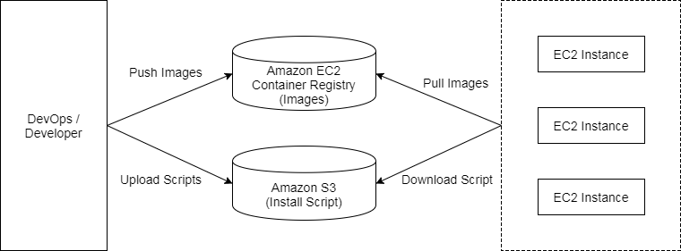


### Outline

1. Create ThingsPro stack using CloudFormation with yaml file MOXA provided.
   1. Main Server (EC2)
   2. Broker Cluster (EC2)
   3. TCP Load Balancer (ELB)
   4. Database (RDS)
   5. Storage (S3)
   6. Jump Box
2. Main Server
   - Prepare main server deployment (with root privilage)
   - Deploy main server
3. MQTT Broker cluster
   - Prepare MQTT Broker cluster deployment (with root privilage)
   - Deploy MQTT Broker cluster
4. Depoly MOXA Cloud Gateways

### Instruction

Before execute below instructions, please make sure you well received two files from Moxa:
1. cloudformation.yaml
1. ThingsProCS-20180919-103700.tar.gz

#### Create ThingsPro stack using CloudFormation with yaml file MOXA provided.

1. Go to https://us-west-2.console.aws.amazon.com/cloudformation/home?region=us-west-2#/stacks/new. Select "Upload a template to Amazon S3" by upload cloudformation template file (cloudformation.yam). Click **Next**.

>  Here we use AWS region: `us-west-2` for instance.)

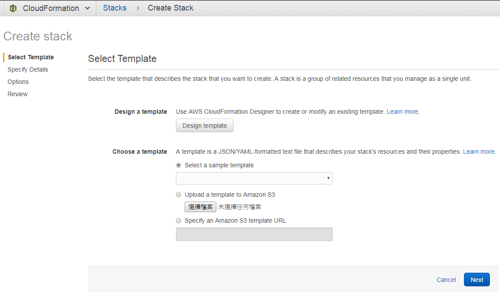


2. Enter your stack name and parameters. Click **Next**.

| Name                              | Value               | Description                              |
| --------------------------------- | ------------------- | ---------------------------------------- |
| Stack Name                        | demo                | Your stack name (only allow a-z, 0-9, ._- )                         |
| Key pair name                     | thingspro-cs-oregon | You could create a key pair [here](https://us-west-2.console.aws.amazon.com/ec2/v2/home?region=us-west-2#KeyPairs:sort=keyName), If you don't have any key pairs. |
| Main Server AMI ID                | ami-6e1a0117        | AMI for Main Server. `ami-6e1a0117` is Ubuntu 16.04 LTS amd64 for region us-west-2. |
| Broker cluster node AMI ID        | ami-6e1a0117        | as above.                                |
| Broker cluster node instance type | t2.large            | Instance type of broker cluster node. Example: t2.micro (3000), t2.medium (15000), or t2.large (25000) |
| DB master username                | moxa                | Master username for Database             |
| DB master password                | moxamoxa            | Master password for Database             |

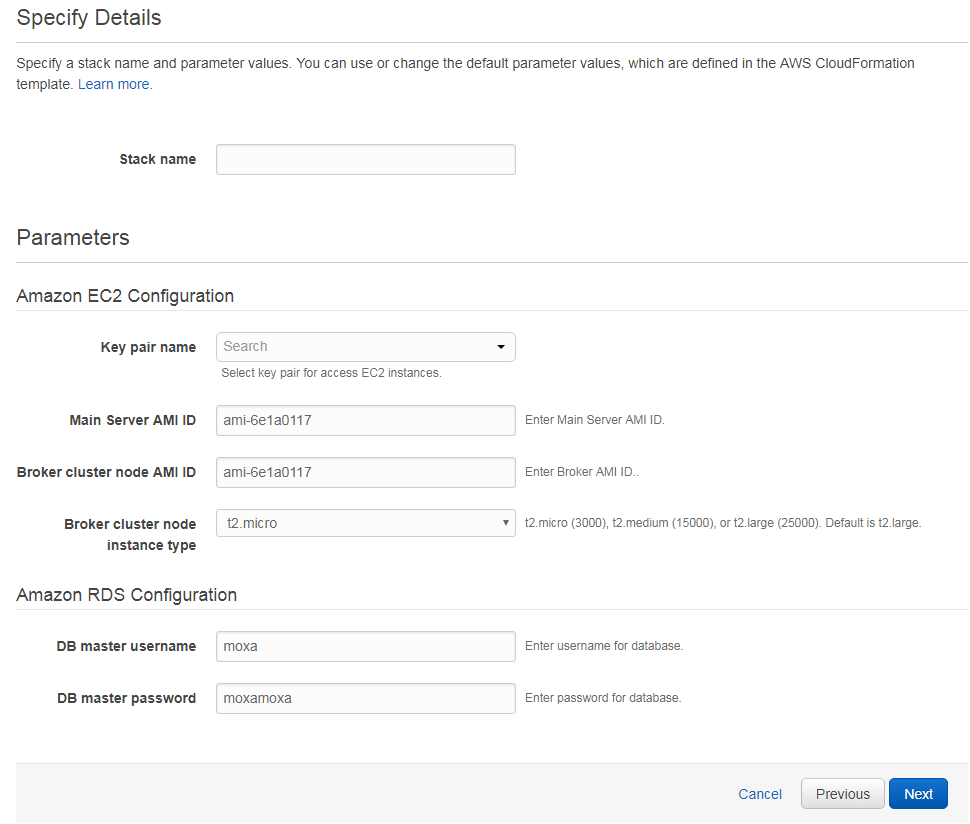

3. (Optional) Add tags or some advanced settings in this page. Click **Next**.

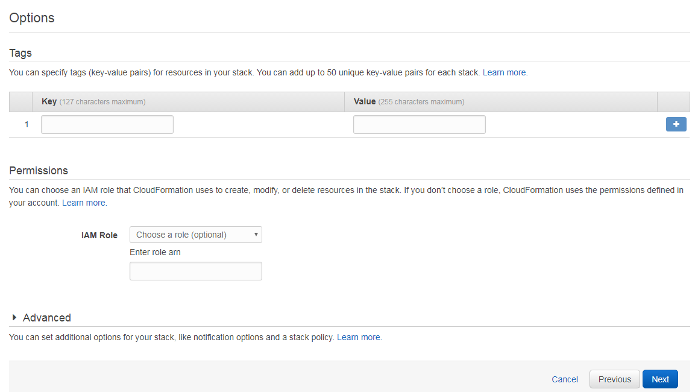

4. In the final step, you could review all the parameters and options and due to ThingsPro stack need to create two roles for services, you have to check the option: "**I acknowledge that AWS CloudFormation might create IAM resources.**" and click **Create**.

   ​

5. Go to [CloudFormation dashboard](https://us-west-2.console.aws.amazon.com/cloudformation/home?region=us-west-2#/stacks?tab=events&filter=active) and check the status.

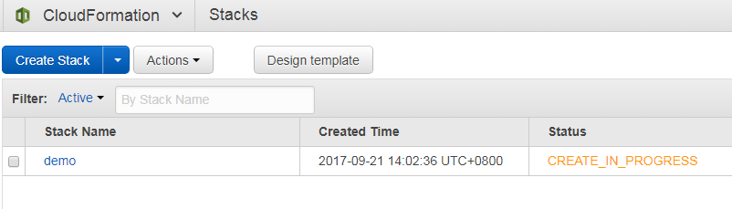

Note: The creation time of stack may take more than 5 minutes depends on Amazon web service performance, please wait.


6. Once the status changed to **CREATE_COMPLETE**, click stack name and find **Outputs** section

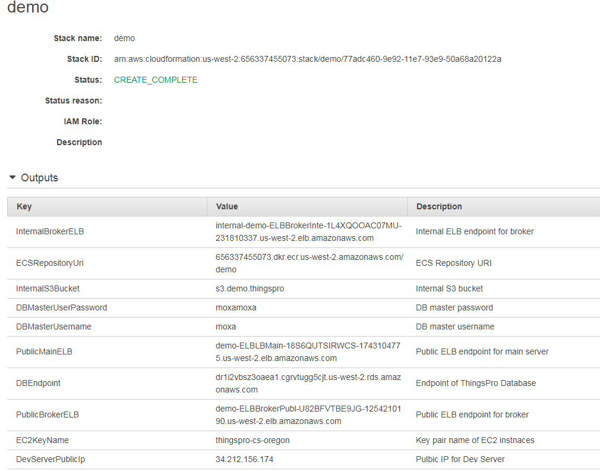

All these keys will be used for configurations, you could copy all the output key/value in notepad for later use.

> For more usage about CloudFormation please refer to [CloudFormation Documentation](https://aws.amazon.com/documentation/cloudformation/).


#### Main Server

CloudFormation created 2 virtual machines on EC2. The instance type: t2.micro, which be named by Jump Box was one, we are going to deal with.
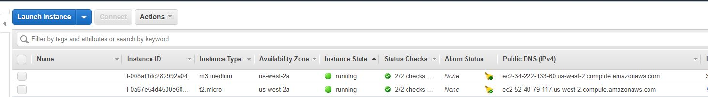

#### Prepare main server deployment (with root privilage)

1. Upload installation assets (ThingsProCS-20180919-103700.tar.gz) to Jump Box (with ip `DevServerPublicIp`). For example:
   `rsync -avP -e 'ssh -i thingspro-cs-oregon.pem' ThingsProCS-20180919-103700.tar.gz ubuntu@34.212.156.174:/home/ubuntu`

   ​

2. Login to Jump Box with key pair `EC2KeyName` and ip `DevServerPublicIp`.
   For instance: `ssh -i  thingspro-cs-oregon.pem ubuntu@34.212.156.174`

   ​

3. Unzip ThingsProCS-20180919-103700.tar.gz to `/home/ubuntu/thingspro`

   ```
   root@ip-172-99-10-174:/home/ubuntu# mkdir thingspro
   root@ip-172-99-10-174:/home/ubuntu# tar zxvf ThingsProCS-20180919-103700.tar.gz -C thingspro
   ```

   ​

4. Upload docker images to ECS
  

   1. Import images to local docker repository

      ```shell
      root@ip-172-99-9-41:/home/ubuntu# cd thingspro
      root@ip-172-99-9-41:/home/ubuntu/thingspro# make import-images
      ```

   2. Push to ECS repository

      **VERSION** : build version of ThingsProCS-`20180919-103700`.tar.gz

      **STACK** : the `Stack Name` you created for cloudFormation

      **IMAGE_REPO** : `ECSRepositoryUri` of (**Outputs** section)
      
      example :
      ```shell
      root@ip-172-99-9-41:/home/ubuntu/thingspro# make push-images VERSION=20170921-144442 STACK=demo IMAGES_REPO=656337455073.dkr.ecr.us-west-2.amazonaws.com/demo
      ```

      ​

5. Modify deploy script for main server `scripts/aws-init-master.sh`

      **STACKNAME** : the `Stack Name` you created for cloudFormation

      **ECSRepositoryUri** : `ECSRepositoryUri` of (**Outputs** section)

   edit scripts/aws-init-master.sh by following values:
   ```shell
   export STACKNAME=demo
   export ECSRepositoryUri=656337455073.dkr.ecr.us-west-2.amazonaws.com/demo

   # ECR endpoint and region
   export IMAGE_REPO="$ECSRepositoryUri"
   export ECS_REGION=us-west-2
   ```

6. Create & Upload `deploy.tar.gz` to s3

      **STACKNAME** : the `Stack Name` you created for cloudFormation

   ```shell   
   root@ip-172-99-9-41:/home/ubuntu/thingspro# make deploy.tar.gz
   root@ip-172-99-10-174:/home/ubuntu/thingspro# aws s3 cp deploy.tar.gz s3://s3.<STACKNAME>.thingspro
   ```

#### Deploy main server

CloudFormation created 2 virtual machines on EC2. The instance type: m3.medium, which be named by main server was one, we are going to deal with.


1. Login to main server which is not be public accessible from internet.

   - Create a ssh tunnel and login to (private) main server via public `DevServerPublicIp` 

   ```
   ssh -i <PATH-TO-YOUR-KEY> -o "ProxyCommand ssh -W %h:%p -i <PATH-TO-YOUR-KEY> ubuntu@<DEV-PUBLIC-IP>" ubuntu@<MAIN-SERVER-PRIVATE-IP> -v
   ```

2. Download `deploy.tar.gz` from s3 bucket and decompress

      **STACKNAME** : the `Stack Name` you created for cloudFormation

   ```shell
   ubuntu@ip-172-99-0-208:~$ aws s3 cp s3://s3.<STACKNAME>.thingspro/deploy.tar.gz .
   ubuntu@ip-172-99-0-208:~$ mkdir thingspro
   ubuntu@ip-172-99-0-208:~$ tar zxvf deploy.tar.gz -C thingspro/
   ```

3. Execute init script with **root** permission

   ```shell
   root@ip-172-99-0-208:/home/ubuntu# cd thingspro
   root@ip-172-99-0-208:/home/ubuntu/thingspro# bash scripts/aws-init-master.sh
   ```

4. Edit `.env` file

   ```shell
   root@ip-172-99-0-208:/home/ubuntu/thingspro# cp config/.env-master-example .env
   root@ip-172-99-0-208:/home/ubuntu/thingspro# vim .env
   ```

   The following parameters should be updated in .env file:

   - `IMAGE_REPO` : `ECSRepositoryUri` of (**Outputs** section) 
   - `BASEURL` : http:// + `PublicMainELB` of (**Outputs** section) 
   - `MX_API_TOKEN` : Empty 
   - `DATABASE_HOST` : `DBEndpoint` of (**Outputs** section) 
   - `FILEBIN_PATH` : http:// + `PublicMainELB` of (**Outputs** section) + /filebin

   ```shell
   IMAGE_REPO=
   BASEURL=
   MX_API_TOKEN=
   DATABASE_HOST=	
   FILEBIN_PATH=
   ```

5. Init database

   ```shell
   root@ip-172-99-0-208:/home/ubuntu/thingspro# bash scripts/init-db.sh 
   ```

   This command will create default databases.

6. Start services

   ```shell
   root@ip-172-99-0-208:/home/ubuntu/thingspro# bash scripts/init-master.sh 
   ```

   Note: After services up, it will take a few mintues for [ELB health checking](https://us-west-2.console.aws.amazon.com/ec2/v2/home?region=us-west-2#LoadBalancers:).

7. Create token and update `.env` file

   1. Visit PublicMainELB `http://demo-elblbmain-18s6qutsirwcs-1743104775.us-west-2.elb.amazonaws.com/`

   2. Login as root, `root@moxa.com / root1234`

   3. Create token with read/write scope.

   4. Copy token and update `.env` file.

   5. Restart all services by executing command:

      ```shell
      root@ip-172-99-0-208:/home/ubuntu/thingspro# bash scripts/init-master.sh 
      ```

   ​


#### Prepare MQTT Brokers deployment

1. On Jump Box, edit file `scripts/aws-init-slave.sh` 

   ```shell
   root@ip-172-99-10-174:/home/ubuntu/thingspro# vim scripts/aws-init-slave.sh
   ```

   The following parameters should be updated in aws-init-slave.sh file:

   - `STACKNAME` : the `Stack Name` you created for cloudFormation
   - `ECSRepositoryUri` : `ECSRepositoryUri` of (**Outputs** section) 
   - `ECS_REGION` : the AWS Region you deploy this service 
   - `MX_API_TOKEN` : the token you created at ThingsPro CS Web 
   - `BROKER_MAX_CLIENTS` : if you have changed cluster instance type 

  
   ```shell
   export STACKNAME=
   export ECSRepositoryUri=

   # ECR endpoint and region
   export IMAGE_REPO="$ECSRepositoryUri"
   export ECS_REGION=us-west-2

   # API token
   export MX_API_TOKEN=''

   # Number of broker max clients
   # t2.micro (3000), t2.medium (15000), or t2.large (25000)
   export BROKER_MAX_CLIENTS=25000
   ```

2. Upload `scripts/aws-init-slave.sh` to S3

   - `STACKNAME` : the `Stack Name` you created for cloudFormation

   ```shell
   root@ip-172-99-10-174:/home/ubuntu/thingspro# aws s3 cp scripts/aws-init-slave.sh s3://s3.<STACKNAME>.thingspro
   ```

   ​

#### Deploy 

1. Go to [Auto Scaling Group page](https://us-west-2.console.aws.amazon.com/ec2/autoscaling/home?region=us-west-2#AutoScalingGroups:view=details) and modify stackname-*'s desired to `2`.

   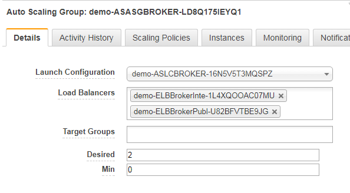

   In this case we create a minimal cluster for example, you could create more instances for get more devices connected.

   Limits:

   - t2.micro up to 20
   - t2.medium up to 4
   - t2.large up to 3

2. After instances are created

   1. go to [Instances page](https://us-west-2.console.aws.amazon.com/ec2/v2/home?region=us-west-2#Instances:sort=desc:launchTime) to get instance's private ip address.

      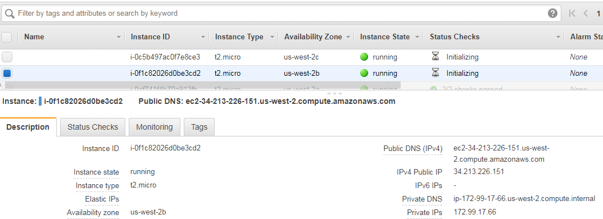

   2. Go to [Route 53](https://console.aws.amazon.com/route53/home), create a record set.

      - Name `cluster`

      - Type `A`

      - TTL (Seconds) `60`

      - Value `two private ip addresses`

        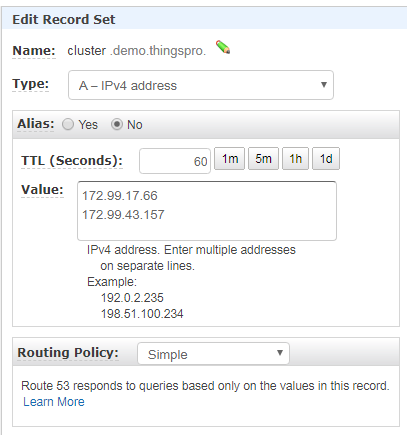

   3. Reboot all broker instances

   4. Check ELB status is `InService`

      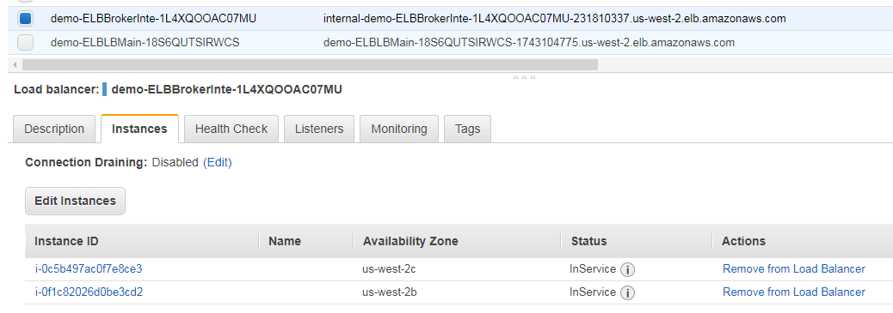

   ​


#### Depoly MOXA Cloud Gateways

1. Get MX_API_TOKEN

2. Domain name settings

   1. PublicMainELB is for Web, RESTful API access
   2. PublicBrokerELB is for MQTT protocol which means remote control host should be PublicBrokerELB

3. Use IIoTEnablement or RESTful to do regstration.

   ​

## Maintaince

### Upgrade

1. Download latest installation assets from link MOXA provided.
2. Backup RDS/S3
3. Follow the instruction with the installation assets if there are any.


## Trouble shooting

1. On CG, hit remote control test connection ok and Check cluster status

   ```shell
   docker exec -i tp_broker_1 emqttd_ctl cluster status
   ```

   Note: This command could be executed by AWS Systems Manager Services

   (insert screenshots herer)

2. Push images to ECS with no auth message

   ```shell
   aws ecr get-login --no-include-email --region "$ECS_REGION" | tr -d '\r' > /tmp/login && bash /tmp/login
   ```

3. ​

## Appendix

### AMI Mapping Table (Ubuntu 16.04 LTS)

| Region         |  Release  | AMI-ID                |
|----------------|-----------|-----------------------|
| us-east-1      |  20180814 | ami-04169656fea786776 |
| us-west-1      |  20180814 | ami-059e7901352ebaef8 |
| ap-northeast-1 |  20180814 | ami-02115cef40fbb46a4 |
| sa-east-1      |  20180814 | ami-08b78b890b5a86161 |
| ap-southeast-1 |  20180814 | ami-03221428e6676db69 |
| ca-central-1   |  20180814 | ami-9526abf1          |
| ap-south-1     |  20180814 | ami-00b7e666605d33085 |
| eu-central-1   |  20180814 | ami-027583e616ca104df |
| eu-west-1      |  20180814 | ami-0181f8d9b6f098ec4 |
| cn-north-1     |  20180814 | ami-0987442b0b3be4589 |
| cn-northwest-1 |  20180814 | ami-085d69987e6675f08 |
| us-gov-west-1  |  20180806 | ami-3a4dd15b          |
| ap-northeast-2 |  20180814 | ami-00ca7ffe117e2fe91 |
| ap-southeast-2 |  20180814 | ami-059b78064586da1b7 |
| us-west-2      |  20180814 | ami-51537029          |
| us-east-2      |  20180814 | ami-0552e3455b9bc8d50 |
| eu-west-2      |  20180814 | ami-c7ab5fa0          |
| ap-northeast-3 |  20180814 | ami-06ad95b4dfffa1d22 |
| eu-west-3      |  20180814 | ami-0370f4064dbc392b9 |

reference：https://cloud-images.ubuntu.com/locator/ec2/